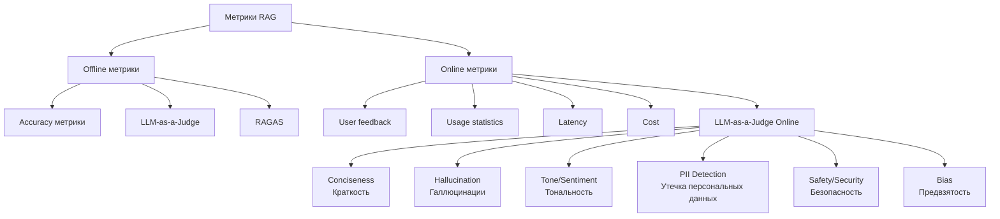
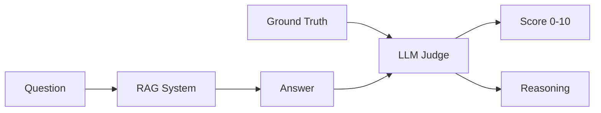
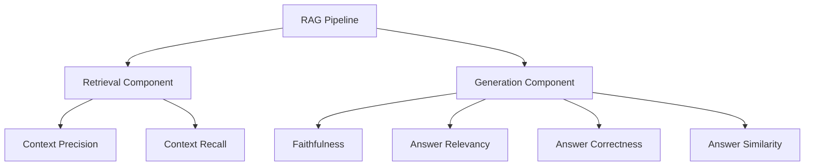
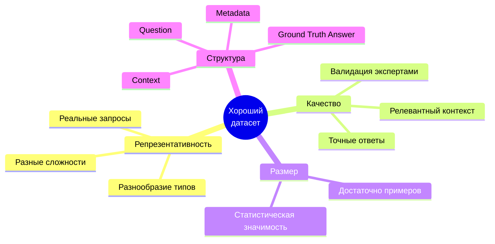
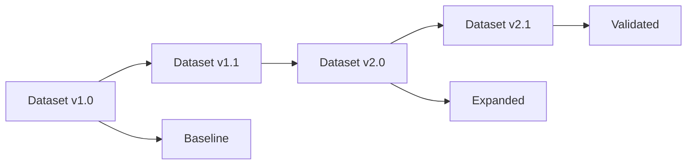
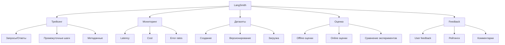
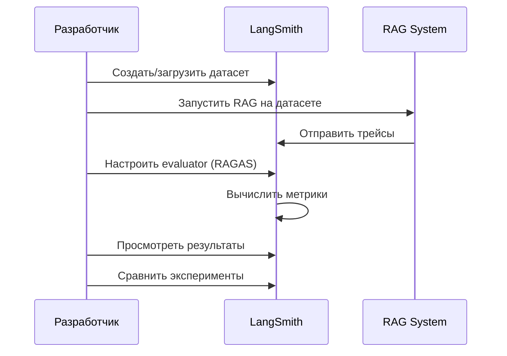

# Оценка качества RAG систем

## Зачем измерять метрики RAG?

### Проблемы без оценки качества

- **Нет объективной оценки** работы системы
- **Сложно сравнивать** разные подходы и модели
- **Невозможно отследить деградацию** при изменениях
- **Нет понимания** слабых мест системы
- **Сложно оптимизировать** без метрик

### Преимущества систематической оценки

- ✅ Объективное сравнение различных конфигураций
- ✅ Выявление проблемных компонентов (retrieval vs generation)
- ✅ Отслеживание качества при изменениях
- ✅ Data-driven оптимизация системы
- ✅ Доверие к системе в production

---

## Классификация метрик для RAG

### Offline vs Online метрики



### Offline метрики

**Когда использовать:**
- Разработка и тестирование
- Сравнение различных конфигураций
- A/B тестирование перед деплоем
- Регрессионное тестирование

**Особенности:**
- Требуют ground truth датасет
- Вычисляются на фиксированном наборе данных
- Не требуют production трафика

### Online метрики

**Когда использовать:**
- Мониторинг production системы
- Отслеживание качества в реальном времени
- Сбор feedback от пользователей
- Анализ использования системы

**Особенности:**
- Основаны на реальных запросах пользователей
- Требуют инфраструктуру для сбора данных
- Позволяют отслеживать тренды

---

## Offline метрики: Accuracy

### От точного совпадения к семантическому пониманию

#### 1. Exact Match (EM)
- **Что измеряет:** Точное совпадение ответа с эталоном
- **Плюсы:** Простота вычисления, объективность
- **Минусы:** Не учитывает семантическую эквивалентность

```python
# Пример
ground_truth = "Ставка по кредиту составляет 15%"
prediction = "Ставка по кредиту составляет 15%"
# EM = 1.0

prediction = "Процентная ставка кредита равна 15 процентам"
# EM = 0.0 (но семантически верно!)
```

#### 2. F1 Score (Token-level)
- **Что измеряет:** Пересечение токенов между ответом и эталоном
- **Плюсы:** Учитывает частичные совпадения
- **Минусы:** Все еще не учитывает семантику

#### 3. BLEU Score
- **Что измеряет:** N-gram совпадения (из машинного перевода)
- **Плюсы:** Стандартизированная метрика
- **Минусы:** Плохо работает для вопросно-ответных систем

#### 4. Semantic Similarity (Embedding-based)
- **Что измеряет:** Косинусное расстояние между эмбеддингами
- **Плюсы:** Учитывает семантическое сходство
- **Минусы:** Зависит от качества embedding модели

```python
from sentence_transformers import SentenceTransformer

model = SentenceTransformer('all-MiniLM-L6-v2')
emb1 = model.encode(ground_truth)
emb2 = model.encode(prediction)
similarity = cosine_similarity(emb1, emb2)
```

---

## LLM-as-a-Judge

### Принцип работы



### Преимущества

- ✅ Понимает семантику и контекст
- ✅ Может оценивать корректность, релевантность, полноту
- ✅ Объясняет свою оценку
- ✅ Гибкость в критериях оценки

### Ограничения

- ⚠️ Зависит от качества LLM-судьи
- ⚠️ Может быть непоследовательным
- ⚠️ Дороже в вычислении
- ⚠️ Может иметь bias

### Пример промпта для LLM-as-a-Judge

```
You are an expert evaluator of question-answering systems.

Question: {question}
Ground Truth Answer: {ground_truth}
System Answer: {answer}
Retrieved Context: {context}

Evaluate the system answer on a scale of 0-10 considering:
1. Correctness: Is the answer factually correct?
2. Completeness: Does it fully answer the question?
3. Relevance: Is it relevant to the question?

Provide:
- Score (0-10)
- Brief reasoning
```

---

## RAGAS: Framework для оценки RAG

### Что такое RAGAS?

**RAGAS (Retrieval-Augmented Generation Assessment)** — специализированный фреймворк для оценки качества RAG систем.

### Архитектура метрик RAGAS



### Метрики RAGAS

#### 1. Faithfulness (Верность)

**Что измеряет:** Насколько ответ основан на предоставленном контексте, без галлюцинаций

**Формула:**
```
Faithfulness = 1 - (количество необоснованных утверждений / общее количество утверждений)
```

**Пример:**
- **Контекст:** "Ставка по кредиту составляет 15% годовых"
- **Ответ:** "Ставка по кредиту составляет 15% годовых" ✅ Faithfulness = 1.0
- **Ответ:** "Ставка по кредиту составляет 20% годовых" ❌ Faithfulness = 0.0

**Когда важна:** Критична для production систем, где важна точность фактов

#### 2. Answer Relevancy (Релевантность ответа)

**Что измеряет:** Насколько ответ релевантен вопросу

**Как вычисляется:**
- Генерируются гипотетические вопросы к ответу
- Оценивается семантическое сходство этих вопросов с исходным вопросом

**Пример:**
- **Вопрос:** "Какая ставка по кредиту?"
- **Ответ:** "Ставка по кредиту составляет 15%" ✅ Relevancy = 1.0
- **Ответ:** "Банк работает с 9 до 18" ❌ Relevancy = 0.2

**Когда важна:** Обеспечивает, что система отвечает на вопрос пользователя

#### 3. Answer Correctness (Корректность ответа)

**Что измеряет:** Комбинация faithfulness и answer similarity к ground truth

**Формула:**
```
Correctness = (Faithfulness + Answer Similarity) / 2
```

**Когда важна:** Общая метрика качества ответа

#### 4. Answer Similarity (Сходство ответа)

**Что измеряет:** Семантическое сходство ответа с ground truth

**Как вычисляется:** Использует embedding модели для сравнения

**Пример:**
- **Ground Truth:** "Ставка по кредиту составляет 15% годовых"
- **Ответ:** "Процентная ставка кредита равна 15 процентам в год" ✅ Similarity = 0.95
- **Ответ:** "Ставка по кредиту составляет 15% годовых" ✅ Similarity = 1.0

#### 5. Context Recall (Полнота контекста)

**Что измеряет:** Насколько весь релевантный контекст был извлечен

**Два способа расчета:**

**1. С GT Contexts:** `Context Recall = |Retrieved ∩ GT Contexts| / |GT Contexts|`
- Требует экспертную разметку релевантных чанков
- Объективно, но дорого в разметке

**2. Без GT Contexts (LLM-based, RAGAS):** LLM проверяет, можно ли найти каждое утверждение из GT Answer в извлеченных контекстах
- Требует только Question + GT Answer
- Автоматически, но зависит от качества LLM

**Пример:**
- **GT Contexts:** 5 релевантных чанков (размечены экспертами)
- **Retrieved:** Извлечено 3 из 5 релевантных чанков
- **Context Recall = 3/5 = 0.6**

**Когда важна:** Оценка качества retrieval компонента

#### 6. Context Precision (Точность контекста)

**Что измеряет:** Насколько извлеченный контекст релевантен вопросу

**Два способа расчета:**

**1. С GT Contexts:** `Context Precision = |Retrieved ∩ GT Contexts| / |Retrieved|`
- Требует экспертную разметку релевантных чанков
- Объективно, но дорого в разметке

**2. Без GT Contexts (LLM-based, RAGAS):** LLM оценивает релевантность каждого извлеченного чанка вопросу
- Требует только Question + GT Answer
- Автоматически, но зависит от качества LLM

**Пример:**
- **Retrieved:** 5 чанков
- **Relevant:** 3 чанка релевантны вопросу
- **Context Precision = 3/5 = 0.6**

**Когда важна:** Оценка качества retrieval компонента

---

### Таблица метрик RAGAS

| Метрика | Компонент | Что измеряет | Диапазон | Идеальное значение | Требования к GT |
|---------|-----------|--------------|----------|-------------------|-----------------|
| **Faithfulness** | Generation | Отсутствие галлюцинаций | 0-1 | 1.0 | ❌ |
| **Answer Relevancy** | Generation | Релевантность ответа вопросу | 0-1 | 1.0 | ❌ |
| **Answer Correctness** | Generation | Общая корректность | 0-1 | 1.0 | ✅ GT Answer |
| **Answer Similarity** | Generation | Сходство с ground truth | 0-1 | 1.0 | ✅ GT Answer |
| **Context Recall** | Retrieval | Полнота извлечения | 0-1 | 1.0 | ⚠️ GT Answer или GT Contexts |
| **Context Precision** | Retrieval | Точность извлечения | 0-1 | 1.0 | ⚠️ GT Answer или GT Contexts |

---

## Важность датасета для оценки качества RAG

### Почему датасет критичен?

- **Нет датасета = нет объективной оценки**
- **Плохой датасет = неверные выводы**
- **Хороший датасет = надежная оценка и оптимизация**

### Что делает датасет хорошим?



---

## Создание датасета для оценки RAG

### Источники данных

#### 1. Анализ реальных диалогов

**Преимущества:**
- ✅ Реальные запросы пользователей
- ✅ Репрезентативность
- ✅ Разнообразие формулировок

**Процесс:**
1. Сбор логов диалогов из production/тестовой системы
2. Анализ паттернов запросов
3. Классификация по типам вопросов
4. Извлечение репрезентативных примеров

**Типы вопросов для включения:**
- Простые фактологические вопросы
- Сложные многошаговые вопросы
- Уточняющие вопросы
- Вопросы с неоднозначностью
- Вопросы вне домена

#### 2. Синтез на основе документов

**Преимущества:**
- ✅ Контролируемое качество
- ✅ Покрытие всех разделов документов
- ✅ Масштабируемость

**Подходы:**

**a) LLM-based синтез:**
```python
# Псевдокод
for chunk in documents:
    questions = llm.generate_questions(chunk)
    answers = llm.generate_answers(chunk, questions)
    dataset.append({
        'question': questions,
        'answer': answers,
        'context': chunk
    })
```

**b) Template-based синтез:**
- Использование шаблонов вопросов
- Заполнение конкретными данными из документов

**c) Hybrid подход:**
- Комбинация LLM синтеза и ручной валидации

#### 3. Ручное создание

**Когда использовать:**
- Критичные домены (медицина, финансы)
- Небольшие специализированные датасеты
- Валидация синтезированных данных

**Процесс:**
1. Эксперты создают вопросы на основе документов
2. Эксперты формулируют точные ответы
3. Эксперты определяют релевантный контекст
4. Валидация и ревью

### Структура датасета

#### Минимальная структура

```python
{
    "question": str,           # Вопрос пользователя
    "ground_truth": str,       # Эталонный ответ
    "contexts": List[str],     # Релевантные чанки из документов
    "metadata": dict           # Дополнительная информация
}
```

#### Расширенная структура

```python
{
    "question": str,
    "ground_truth": str,
    "contexts": List[str],
    "metadata": {
        "source_document": str,
        "question_type": str,      # "factual", "complex", "comparison"
        "difficulty": str,         # "easy", "medium", "hard"
        "domain": str,
        "created_by": str,         # "human", "llm", "synthetic"
        "validation_status": str   # "validated", "pending"
    }
}
```

### Размер датасета

#### Рекомендации

| Цель | Минимальный размер | Рекомендуемый размер |
|------|-------------------|----------------------|
| Прототип | 20-50 примеров | 100+ примеров |
| Разработка | 50-100 примеров | 200-500 примеров |
| Production оценка | 100+ примеров | 500-1000+ примеров |
| A/B тестирование | 200+ примеров | 1000+ примеров |

#### Распределение по типам

- **60%** - типичные запросы (основные use cases)
- **25%** - edge cases (граничные случаи)
- **15%** - негативные примеры (вне домена, некорректные вопросы)

### Управление датасетом

#### Версионирование



**Практики:**
- Использовать семантическое версионирование (v1.0, v1.1, v2.0)
- Хранить историю изменений
- Тегировать версии (baseline, expanded, validated)

#### Дополнение датасета

**Когда дополнять:**
- Обнаружены новые типы ошибок
- Добавлены новые документы в базу знаний
- Изменились паттерны запросов пользователей
- Низкое покрытие определенных типов вопросов

**Процесс:**
1. Анализ ошибок на текущем датасете
2. Выявление gaps в покрытии
3. Создание новых примеров (синтез или ручное)
4. Валидация новых примеров
5. Добавление в датасет с новой версией

#### Хранение и формат

**Форматы:**
- **JSON/JSONL** - для программной обработки
- **CSV** - для анализа в Excel/таблицах
- **Parquet** - для больших датасетов

**Рекомендации:**
- Хранить в системе контроля версий (Git)
- Использовать структурированные форматы
- Включать метаданные для трассируемости

---

## LangSmith: Платформа для мониторинга и оценки

### Возможности LangSmith



### Основные компоненты

#### 1. Трейсинг (Tracing)

**Что это:**
- Автоматическое логирование всех вызовов LLM
- Запись промежуточных шагов в цепочках
- Метаданные о запросах и ответах

**Что записывается:**
- Входные данные (questions, context)
- Выходные данные (answers)
- Промежуточные шаги (retrieval, transformation)
- Время выполнения
- Стоимость токенов
- Ошибки

**Использование:**
```python
from langchain_core.tracers import LangChainTracer

# Автоматический трейсинг при использовании LangChain
# Настройка через переменные окружения:
# LANGCHAIN_TRACING_V2=true
# LANGCHAIN_API_KEY=your_key
# LANGCHAIN_PROJECT=your_project
```

#### 2. Мониторинг (Monitoring)

**Метрики:**
- **Latency** - время ответа системы
- **Cost** - стоимость запросов к LLM
- **Error rates** - частота ошибок
- **Token usage** - использование токенов
- **User satisfaction** - удовлетворенность пользователей

**Дашборды:**
- Визуализация метрик в реальном времени
- Алерты при аномалиях
- Тренды и аналитика

#### 3. Датасеты (Datasets)

**Возможности:**
- Создание и управление датасетами
- Версионирование датасетов
- Загрузка через API или UI
- Экспорт датасетов

**Структура:**
```python
dataset = {
    "name": "rag_evaluation_v1",
    "description": "Evaluation dataset for RAG system",
    "examples": [
        {
            "inputs": {"question": "..."},
            "outputs": {"answer": "..."},
            "metadata": {...}
        }
    ]
}
```

#### 4. Оценка (Evaluations)

**Offline оценки:**
- Запуск оценок на датасетах
- Вычисление метрик (RAGAS, custom)
- Сравнение различных конфигураций
- Регрессионное тестирование

**Online оценки:**
- Автоматическая оценка production запросов
- Интеграция с feedback системой
- Агрегация метрик качества

**Процесс:**
1. Загрузить датасет в LangSmith
2. Настроить evaluator (RAGAS или custom)
3. Запустить оценку на трейсах
4. Просмотреть результаты в UI
5. Сравнить разные эксперименты

#### 5. Feedback (Обратная связь)

**Типы feedback:**
- **Рейтинги** - числовая оценка (1-5)
- **Комментарии** - текстовый feedback
- **Корректировки** - исправления ответов
- **Флаги** - пометка проблемных случаев

**Интеграция:**
- Сбор feedback от пользователей
- Автоматическая отправка в LangSmith
- Использование для улучшения системы

### Использование LangSmith для оценки RAG

#### Workflow оценки



#### Пример использования

**1. Настройка трейсинга:**
```python
import os
os.environ["LANGCHAIN_TRACING_V2"] = "true"
os.environ["LANGCHAIN_API_KEY"] = "your_api_key"
os.environ["LANGCHAIN_PROJECT"] = "rag_evaluation"
```

**2. Загрузка датасета:**
```python
from langsmith import Client

client = Client()
dataset = client.create_dataset(
    dataset_name="rag_evaluation_v1",
    description="Evaluation dataset"
)
client.create_examples(
    dataset_id=dataset.id,
    examples=[
        {
            "inputs": {"question": "..."},
            "outputs": {"answer": "..."},
            "metadata": {}
        }
    ]
)
```

**3. Запуск оценки:**
```python
from langchain.evaluation import EvaluatorType
from langchain.smith import RunEvaluator

evaluator = RunEvaluator(
    evaluator_type=EvaluatorType.RAGAS,
    # или custom evaluator
)

results = client.evaluate(
    dataset_name="rag_evaluation_v1",
    evaluators=[evaluator],
    # ...
)
```

**4. Просмотр результатов:**
- Открыть LangSmith UI
- Перейти в раздел Evaluations
- Просмотреть метрики и детали
- Сравнить разные эксперименты

### Преимущества использования LangSmith

- ✅ **Централизованное хранение** всех экспериментов
- ✅ **Визуализация** результатов оценки
- ✅ **Сравнение** различных конфигураций
- ✅ **Интеграция** с LangChain экосистемой
- ✅ **Мониторинг** production систем
- ✅ **Версионирование** датасетов и экспериментов

---

## Резюме

### Ключевые моменты

1. **Метрики критичны** для разработки и оптимизации RAG систем
2. **Offline метрики** используются для разработки, **online** - для мониторинга
3. **RAGAS** предоставляет специализированные метрики для RAG
4. **Качественный датасет** - основа надежной оценки
5. **LangSmith** - мощная платформа для управления всем циклом оценки

### Следующие шаги

- Создание датасета для вашей RAG системы
- Настройка трейсинга в LangSmith
- Реализация оценки с использованием RAGAS
- Настройка мониторинга production системы
