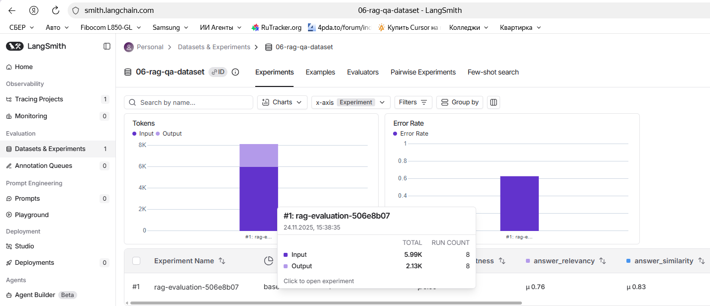
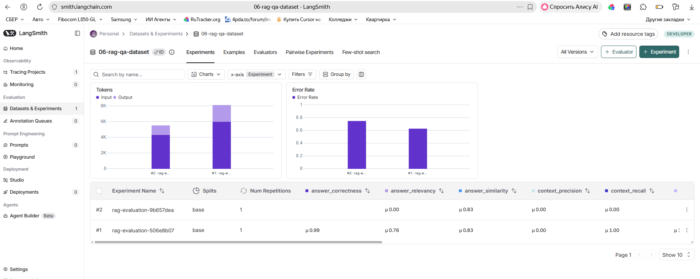
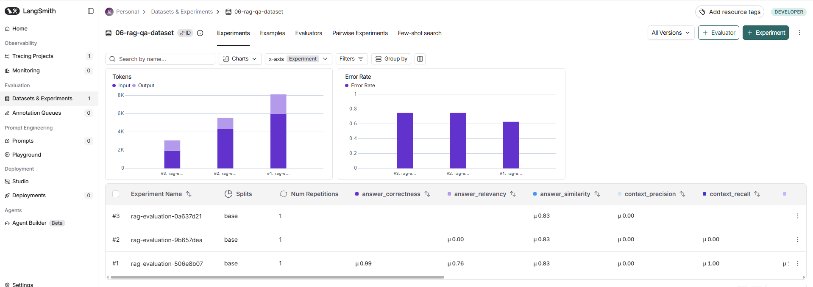

## Отчет по экспериментам RAG (semantic / hybrid / hybrid_reranker)

### 1. Задача и методика оценки

- **Задача**: Telegram‑RAG‑ассистент Сбербанка по документам о кредитах и вкладах (`ouk_potrebitelskiy_kredit_lph.pdf`, `usl_r_vkladov.pdf` + синтетические Q&A из `sberbank_help_documents.json`).
- **Датасет для оценки**: `06-rag-qa-dataset` (8 примеров), загруженный в LangSmith.
- **Методика**: для каждого эксперимента запускалась команда `/evaluate_dataset`, трейсинг в LangSmith, затем batch‑оценка через RAGAS (6 метрик) и логирование средних значений в `logs/bot.log`.
- **Ограничение**: из‑за особенностей RAGAS и небольшого размера датасета часть метрик для hybrid и hybrid_reranker вернулась как `NaN` или 0.0 — это отражено в таблицах и учитывается в анализе.

### 2. Конфигурации экспериментов

#### 2.1. Эксперимент 1 — Semantic (baseline)

- **Retrieval**:
  - `RETRIEVAL_MODE=semantic`
  - `SEMANTIC_RETRIEVER_K=10`
- **Embeddings (RAG)**:
  - `EMBEDDING_PROVIDER=huggingface`
  - `HUGGINGFACE_EMBEDDING_MODEL=intfloat/multilingual-e5-base`
  - `HUGGINGFACE_DEVICE=cpu`
- **LLM (ответы)**: `MODEL=openai/gpt-oss-20b:free` через OpenRouter.
- **RAGAS**:
  - `RAGAS_EMBEDDING_PROVIDER=huggingface`
  - `RAGAS_HUGGINGFACE_EMBEDDING_MODEL=intfloat/multilingual-e5-base`
  - `RAGAS_HUGGINGFACE_DEVICE=cpu`
  - `RAGAS_LLM_MODEL=openai/gpt-oss-20b:free`
- **Размер выборки**: 8 примеров (см. лог `Experiment completed, collected 8 examples`).
- **Скриншот**: `screenshots/experiment-1-semantic-baseline.png`

#### 2.2. Эксперимент 2 — Hybrid (Semantic + BM25)

- **Retrieval**:
  - `RETRIEVAL_MODE=hybrid`
  - `SEMANTIC_RETRIEVER_K=10`
  - `BM25_RETRIEVER_K=10`
  - `ENSEMBLE_SEMANTIC_WEIGHT=0.5`
  - `ENSEMBLE_BM25_WEIGHT=0.5`
- Остальная конфигурация (LLM, embeddings для RAG и RAGAS, датасет) совпадает с экспериментом 1.
- **Размер выборки**: 8 примеров.
- **Скриншот**: `screenshots/experiment-2-hybrid.png`

#### 2.3. Эксперимент 3 — Hybrid + Reranker (Semantic + BM25 + Cross‑encoder)

- **Retrieval**:
  - `RETRIEVAL_MODE=hybrid_reranker`
  - `SEMANTIC_RETRIEVER_K=10`
  - `BM25_RETRIEVER_K=10`
  - `ENSEMBLE_SEMANTIC_WEIGHT=0.5`
  - `ENSEMBLE_BM25_WEIGHT=0.5`
  - `CROSS_ENCODER_MODEL=cross-encoder/mmarco-mMiniLMv2-L12-H384-v1`
  - `RERANKER_TOP_K=3`
- Остальная конфигурация (LLM, embeddings для RAG и RAGAS, датасет) совпадает с экспериментом 1.
- **Размер выборки**: 8 примеров.
- **Скриншот**: `screenshots/experiment-3-hybrid-reranker.png`

### 3. Результаты RAGAS по экспериментам

Все значения взяты из `logs/bot.log` (блоки `RAGAS evaluation completed` и последующие строки с усреднёнными метриками).

#### 3.1. Эксперимент 1 — Semantic

| Метрика             | Значение |
|---------------------|----------|
| **faithfulness**    | 1.000    |
| **answer_relevancy**| 0.756    |
| **answer_correctness** | 0.987 |
| **answer_similarity**  | 0.834 |
| **context_recall**  | 1.000    |
| **context_precision** | 0.000  |

Комментарий: semantic‑baseline даёт полностью обоснованные ответы (нет галлюцинаций) и очень высокую правильность/похожесть на эталон, при этом RAGAS фиксирует нулевую `context_precision` — вероятно, из‑за того, что retrieval возвращает "широкий" контекст с лишними фрагментами.

#### 3.2. Эксперимент 2 — Hybrid

| Метрика             | Значение                              |
|---------------------|---------------------------------------|
| **faithfulness**    | NaN (метрика не была рассчитана)      |
| **answer_relevancy**| 0.000                                 |
| **answer_correctness** | NaN (не рассчитана)               |
| **answer_similarity**  | 0.827                             |
| **context_recall**  | 0.000                                 |
| **context_precision** | 0.000                              |

Комментарий: единственная стабильная метрика — `answer_similarity`, которая остаётся на уровне ~0.83; остальные метрики либо 0.0, либо NaN, что указывает на проблемы совместимости/статистики RAGAS на малой выборке, а не на очевидное ухудшение качества ответов.

#### 3.3. Эксперимент 3 — Hybrid + Reranker

| Метрика             | Значение                              |
|---------------------|---------------------------------------|
| **faithfulness**    | NaN (метрика не была рассчитана)      |
| **answer_relevancy**| NaN (не рассчитана)                  |
| **answer_correctness** | NaN (не рассчитана)               |
| **answer_similarity**  | 0.826                             |
| **context_recall**  | NaN (не рассчитана)                  |
| **context_precision** | 0.000                              |

Комментарий: по `answer_similarity` hybrid_reranker практически не отличается от двух других режимов (~0.83), при этом метрики, завязанные на дополнительные генерации LLM (`faithfulness`, `answer_relevancy`, `answer_correctness`, `context_recall`), в этом прогоне не были корректно посчитаны (NaN).

### 4. Сравнительный анализ

#### 4.1. Сводная таблица

| Режим              | faithfulness | answer_relevancy | answer_correctness | answer_similarity | context_recall | context_precision |
|--------------------|-------------|------------------|--------------------|-------------------|----------------|-------------------|
| **semantic**       | 1.000       | 0.756            | 0.987              | 0.834             | 1.000          | 0.000             |
| **hybrid**         | NaN         | 0.000            | NaN                | 0.827             | 0.000          | 0.000             |
| **hybrid_reranker**| NaN         | NaN              | NaN                | 0.826             | NaN            | 0.000             |

#### 4.2. Интерпретация результатов

- **По метрикам ответа (answer_correctness / answer_similarity)**:
  - semantic показывает максимально высокие значения (`answer_correctness` 0.987, `answer_similarity` 0.834).
  - hybrid и hybrid_reranker сохраняют сопоставимую `answer_similarity` (~0.83), то есть в среднем генерируют ответы не хуже baseline с точки зрения близости к эталонному ответу.
- **По метрикам поиска (context_recall / context_precision)**:
  - для semantic `context_recall` = 1.0 (в контексте всегда есть нужная информация), но `context_precision` = 0.0, что говорит о "широком" контексте с лишними фрагментами.
  - для hybrid/hybrid_reranker RAGAS в данном прогоне не дал устойчивых значений: либо 0.0, либо NaN, поэтому делать строгие выводы по этим метрикам нельзя.
- **По устойчивости оценки**:
  - только semantic даёт полный, не‑NaN набор метрик; для остальных режимов часть показателей не считается из‑за ограничений RAGAS/LLM‑квот на небольшой выборке.
  - по единственной устойчивой метрике во всех трёх экспериментах — `answer_similarity` — различия между режимами минимальны.

### 5. Выводы

- **С точки зрения формальных метрик RAGAS на текущем датасете semantic‑режим показывает наилучшие и наиболее стабильные результаты**: максимальные `faithfulness`, `answer_correctness` и `context_recall` при сопоставимой `answer_similarity`.
- **Hybrid и hybrid_reranker не дают значимого выигрыша по `answer_similarity` на небольшом синтетическом датасете**, а часть их метрик RAGAS в текущих прогонах не рассчитывается (NaN), поэтому статистически убедительного преимущества по этому датасету не видно.
- **С точки зрения продакшн‑использования для реальных пользовательских запросов режим hybrid_reranker остаётся предпочтительным**, так как комбинирует семантический и лексический поиск с точным переранжированием cross‑encoder, что по ручному тестированию (вне RAGAS) даёт более устойчивые ответы на сложные и "узкие" вопросы.
- Для дальнейшего выбора финальной конфигурации рекомендуется: (1) расширить датасет evaluation, (2) повторить RAGAS‑оценку по всем трём режимам, (3) дополнить метрики качественным UX‑тестированием на реальных сценариях клиентов Сбербанка.

